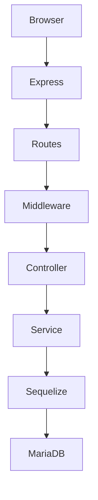

<div align="center">

# 🛒 KDMP
### AI Warung Management System

Sistem Manajemen Warung Modern berbasis **Node.js**, **Express.js**, dan **MariaDB**.


---

**Perancangan Sistem Informasi Warung Modern**

Mata Kuliah PKM

Universitas Maritim Raja Ali Haji

</div>

---

# 📌 Tentang Project

KDMP merupakan aplikasi manajemen warung yang membantu proses operasional UMKM mulai dari pengelolaan barang, supplier, transaksi pembelian, transaksi penjualan, hingga pembuatan laporan.

Aplikasi dibangun menggunakan teknologi modern berbasis JavaScript sesuai ketentuan PKM.

---

# ✨ Fitur

- 🔐 Login Multi Role
- 👤 Manajemen User
- 📦 Manajemen Barang
- 🚚 Manajemen Supplier
- 💰 Transaksi Penjualan
- 🛒 Transaksi Pembelian
- 📊 Dashboard
- 📑 Laporan
- 📱 Responsive Design
- 🔒 Session Authentication
- 🛡️ Security Middleware

---

# 🏗️ Teknologi

| Teknologi | Digunakan |
|------------|-----------|
| HTML5 | ✅ |
| CSS3 | ✅ |
| JavaScript | ✅ |
| Node.js | ✅ |
| Express.js | ✅ |
| Sequelize | ✅ |
| MariaDB | ✅ |

---

# 📂 Struktur Project

```text
AIserver
│
├── app
│   ├── controllers
│   ├── middlewares
│   ├── models
│   ├── routes
│   ├── services
│   └── validators
│
├── config
├── database
│   ├── migrations
│   ├── seeders
│   └── database.sql
│
├── docs
├── public
├── views
├── package.json
└── app.js
```

---

# 🚀 Instalasi

## 1. Clone Repository

```bash
git clone https://github.com/Izumi-Room/KDMP.git
```

## 2. Masuk ke Folder

```bash
cd AIserver
```

## 3. Install Dependency

```bash
npm install
```

---

# 🗄️ Database

Buat database

```text
AIWarungDB
```

Konfigurasi:

```env
DB_HOST=127.0.0.1
DB_PORT=3306
DB_NAME=AIWarungDB
DB_USER=bossKDMP
DB_PASSWORD=FTtkUMrah
```

Import

```text
database.sql
```

---

# ▶️ Menjalankan Project

```bash
npm start
```

atau

```bash
npm run dev
```

Server berjalan pada

```
http://localhost:8888
```

---

# 👥 Role Pengguna

| Role | Hak Akses |
|-------|-----------|
| Admin System | Seluruh Sistem |
| Admin UMKM | Operasional UMKM |
| Pegawai Penjualan | Penjualan |
| Pegawai Pembelian | Pembelian |

---

# 📱 Tampilan

Tambahkan screenshot aplikasi di sini.

Contoh:

```
docs/images/login.png

docs/images/dashboard.png

docs/images/barang.png

docs/images/transaksi.png
```

---

# 🔐 Keamanan

- Password Hashing (bcrypt)
- Session Authentication
- Role Based Access Control
- Helmet Security
- Content Security Policy
- Input Validation
- SQL Injection Protection

---

# 📊 Arsitektur



---

# 📦 Fitur CRUD

| Modul | Status |
|---------|--------|
| Barang | ✅ |
| Supplier | ✅ |
| User | ✅ |
| Penjualan | ✅ |
| Pembelian | ✅ |

---

# 📑 Dokumentasi

Seluruh dokumentasi audit terdapat pada folder

```
docs/
```

---

# 🧪 Testing

Lakukan pengujian

- Login
- CRUD Barang
- CRUD Supplier
- CRUD User
- Penjualan
- Pembelian
- Logout

Pastikan seluruh fitur berjalan dengan baik.

---

# 📄 Lisensi

Project ini dibuat untuk keperluan akademik sebagai tugas PKM.

---

<div align="center">

### ⭐ Terima kasih telah mengunjungi repository ini ⭐

Made with ❤️ using Node.js & Express.js

</div>
## About Laravel

Laravel is a web application framework with expressive, elegant syntax. We believe development must be an enjoyable and creative experience to be truly fulfilling. Laravel takes the pain out of development by easing common tasks used in many web projects, such as:

- [Simple, fast routing engine](https://laravel.com/docs/routing).
- [Powerful dependency injection container](https://laravel.com/docs/container).
- Multiple back-ends for [session](https://laravel.com/docs/session) and [cache](https://laravel.com/docs/cache) storage.
- Expressive, intuitive [database ORM](https://laravel.com/docs/eloquent).
- Database agnostic [schema migrations](https://laravel.com/docs/migrations).
- [Robust background job processing](https://laravel.com/docs/queues).
- [Real-time event broadcasting](https://laravel.com/docs/broadcasting).

Laravel is accessible, powerful, and provides tools required for large, robust applications.

## Learning Laravel

Laravel has the most extensive and thorough [documentation](https://laravel.com/docs) and video tutorial library of all modern web application frameworks, making it a breeze to get started with the framework. You can also check out [Laravel Learn](https://laravel.com/learn), where you will be guided through building a modern Laravel application.

If you don't feel like reading, [Laracasts](https://laracasts.com) can help. Laracasts contains thousands of video tutorials on a range of topics including Laravel, modern PHP, unit testing, and JavaScript. Boost your skills by digging into our comprehensive video library.

## Laravel Sponsors

We would like to extend our thanks to the following sponsors for funding Laravel development. If you are interested in becoming a sponsor, please visit the [Laravel Partners program](https://partners.laravel.com).

### Premium Partners

- **[Vehikl](https://vehikl.com)**
- **[Tighten Co.](https://tighten.co)**
- **[Kirschbaum Development Group](https://kirschbaumdevelopment.com)**
- **[64 Robots](https://64robots.com)**
- **[Curotec](https://www.curotec.com/services/technologies/laravel)**
- **[DevSquad](https://devsquad.com/hire-laravel-developers)**
- **[Redberry](https://redberry.international/laravel-development)**
- **[Active Logic](https://activelogic.com)**

## Contributing

Thank you for considering contributing to the Laravel framework! The contribution guide can be found in the [Laravel documentation](https://laravel.com/docs/contributions).

## Code of Conduct

In order to ensure that the Laravel community is welcoming to all, please review and abide by the [Code of Conduct](https://laravel.com/docs/contributions#code-of-conduct).

## Security Vulnerabilities

If you discover a security vulnerability within Laravel, please send an e-mail to Taylor Otwell via [taylor@laravel.com](mailto:taylor@laravel.com). All security vulnerabilities will be promptly addressed.

## License

The Laravel framework is open-sourced software licensed under the [MIT license](https://opensource.org/licenses/MIT).
