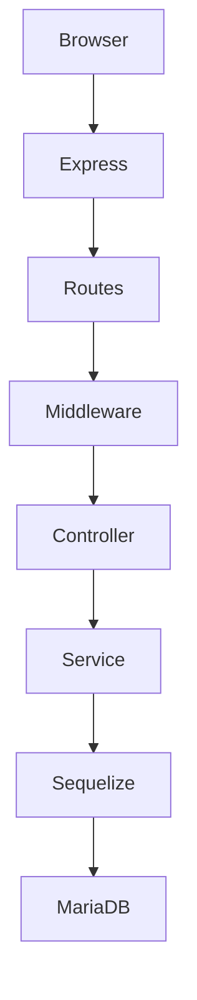

<div align="center">

# 🛒 KDMP
### AI Warung Management System

Sistem Manajemen Warung Modern berbasis **Node.js**, **Express.js**, dan **MariaDB**.


---

**Perancangan Sistem Informasi Warung Modern**

Mata Kuliah PAA

Universitas Maritim Raja Ali Haji

</div>

---

# 📌 Tentang Project

KDMP merupakan aplikasi manajemen warung yang membantu proses operasional UMKM mulai dari pengelolaan barang, supplier, transaksi pembelian, transaksi penjualan, hingga pembuatan laporan.

Aplikasi dibangun menggunakan teknologi modern berbasis JavaScript sesuai ketentuan PKM.

---

# ✨ Fitur

- 🔐 Login Multi Role
- 👤 Manajemen User
- 📦 Manajemen Barang
- 🚚 Manajemen Supplier
- 💰 Transaksi Penjualan
- 🛒 Transaksi Pembelian
- 📊 Dashboard
- 📑 Laporan
- 📱 Responsive Design
- 🔒 Session Authentication
- 🛡️ Security Middleware

---

# 🏗️ Teknologi

| Teknologi | Digunakan |
|------------|-----------|
| HTML5 | ✅ |
| CSS3 | ✅ |
| JavaScript | ✅ |
| Node.js | ✅ |
| Express.js | ✅ |
| Sequelize | ✅ |
| MariaDB | ✅ |

---

# 📂 Struktur Project

```text
AIserver
│
├── app
│   ├── controllers
│   ├── middlewares
│   ├── models
│   ├── routes
│   ├── services
│   └── validators
│
├── config
├── database
│   ├── migrations
│   ├── seeders
│   └── database.sql
│
├── docs
├── public
├── views
├── package.json
└── app.js
```

---

# 🚀 Instalasi

## 1. Clone Repository

```bash
git clone https://github.com/Izumi-Room/KDMP.git
```

## 2. Masuk ke Folder

```bash
cd AIserver
```

## 3. Install Dependency

```bash
npm install
```

---

# 🗄️ Database

Buat database

```text
AIWarungDB
```

Konfigurasi:

```env
DB_HOST=127.0.0.1
DB_PORT=3306
DB_NAME=AIWarungDB
DB_USER=bossKDMP
DB_PASSWORD=FTtkUMrah
```

Import

```text
database.sql
```

---

# ▶️ Menjalankan Project

```bash
npm start
```

atau

```bash
npm run dev
```

Server berjalan pada

```
http://localhost:8888
```

---

# 👥 Role Pengguna

| Role | Hak Akses |
|-------|-----------|
| Admin System | Seluruh Sistem |
| Admin UMKM | Operasional UMKM |
| Pegawai Penjualan | Penjualan |
| Pegawai Pembelian | Pembelian |

---

# 📱 Tampilan

Tambahkan screenshot aplikasi di sini.

Contoh:

```
docs/images/login.png

docs/images/dashboard.png

docs/images/barang.png

docs/images/transaksi.png
```

---

# 🔐 Keamanan

- Password Hashing (bcrypt)
- Session Authentication
- Role Based Access Control
- Helmet Security
- Content Security Policy
- Input Validation
- SQL Injection Protection

---

# 📊 Arsitektur



---

# 📦 Fitur CRUD

| Modul | Status |
|---------|--------|
| Barang | ✅ |
| Supplier | ✅ |
| User | ✅ |
| Penjualan | ✅ |
| Pembelian | ✅ |

---

# 📑 Dokumentasi

Seluruh dokumentasi audit terdapat pada folder

```
docs/
```

---

# 🧪 Testing

Lakukan pengujian

- Login
- CRUD Barang
- CRUD Supplier
- CRUD User
- Penjualan
- Pembelian
- Logout

Pastikan seluruh fitur berjalan dengan baik.

---

# 📄 Lisensi

Project ini dibuat untuk keperluan akademik sebagai tugas PKM.

---

<div align="center">

### ⭐ Terima kasih telah mengunjungi repository ini ⭐

Made with ❤️ using Node.js & Express.js

</div>
